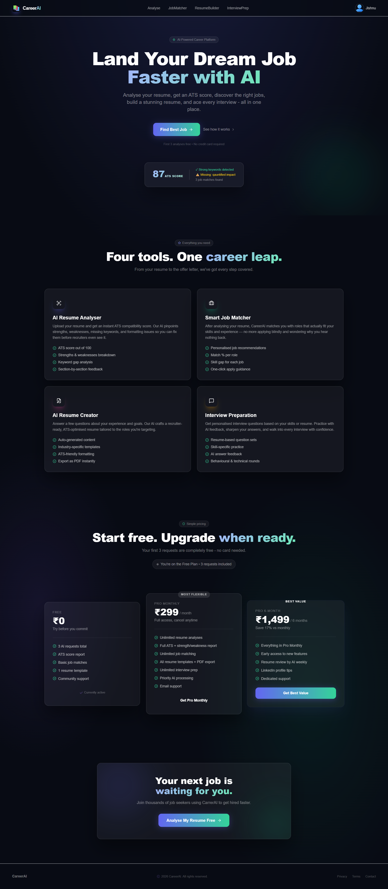
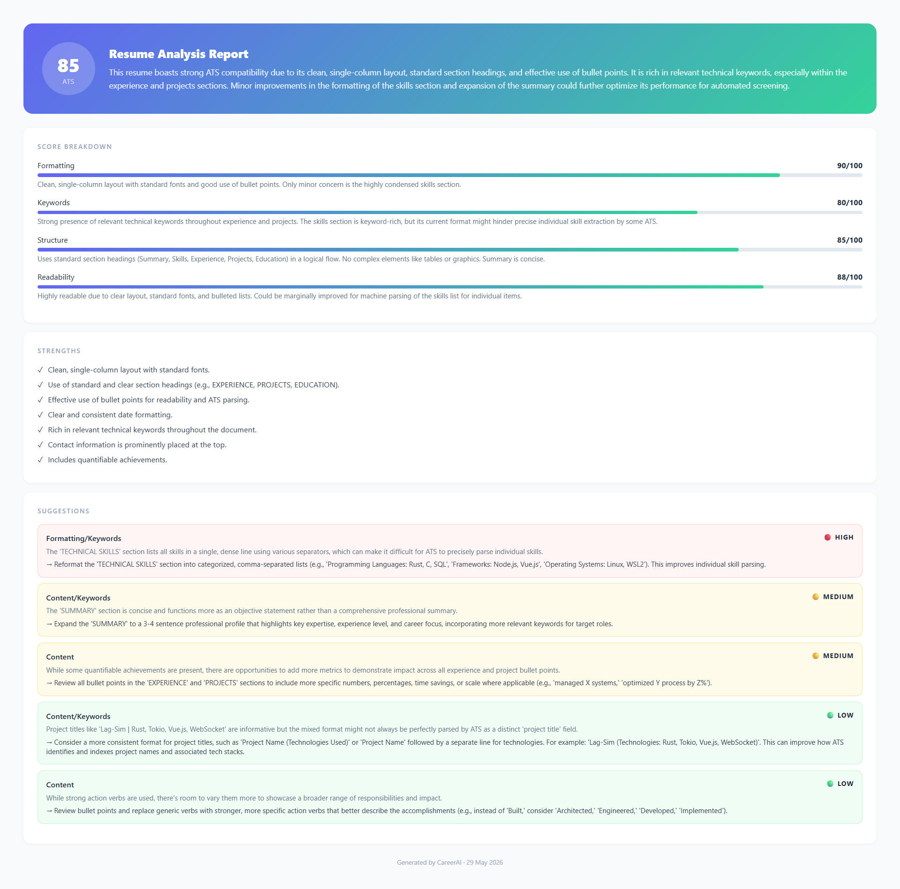
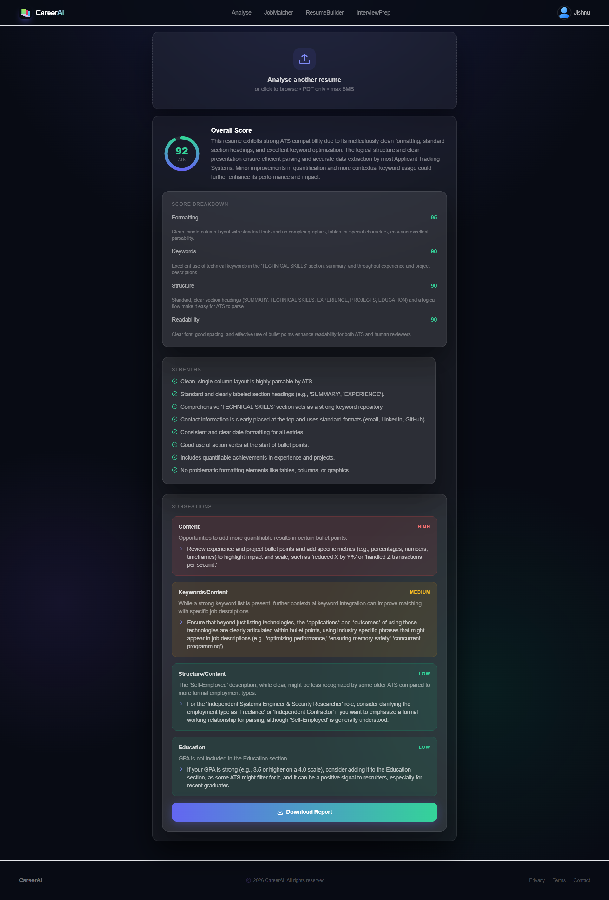
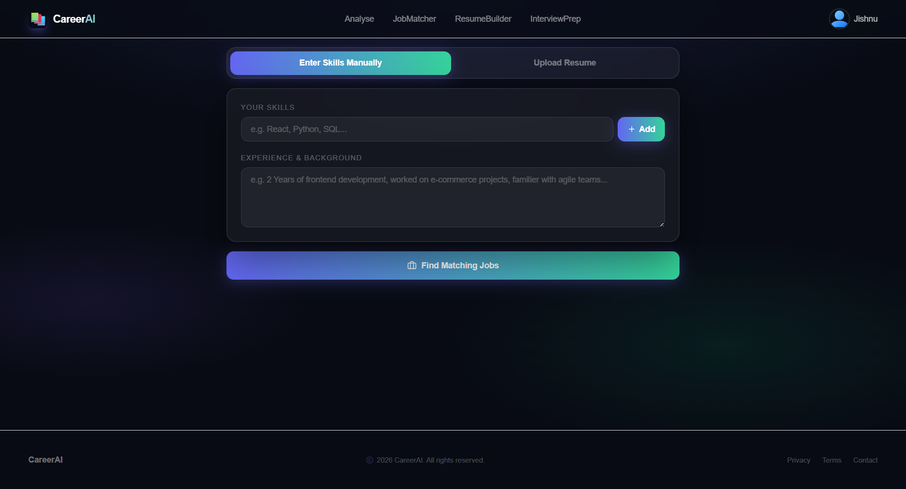
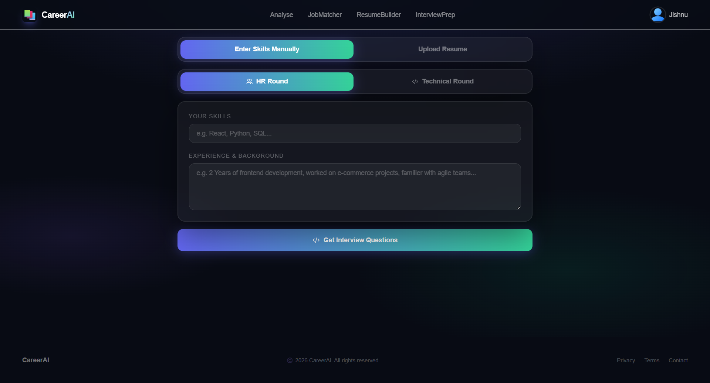
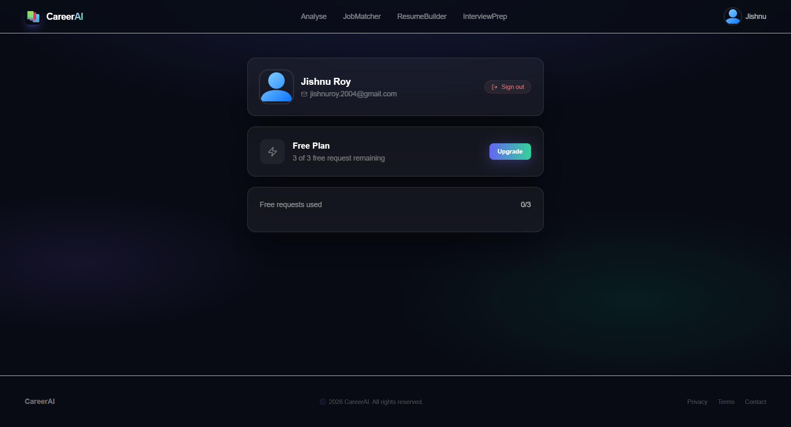

# AI Resume Builder

An AI-powered Resume Builder that helps users create professional, ATS-friendly resumes with ease.  
Built using modern web technologies, this project allows users to generate, customize, preview, and download resumes efficiently.

## Live Demo
https://ai-resume-builder-wine-nine.vercel.app/

## Features
- AI-powered resume content assistance  
- User-friendly resume creation interface  
- Multiple resume sections (Education, Skills, Experience, Projects)  
- Real-time preview  
- Professional and responsive UI  
- Resume download/export functionality  
- Secure and scalable architecture  

## Tech Stack

### Frontend
- React.js
- Tailwind CSS
- Vite

### Backend
- Node.js
- Express.js

### Database
- MongoDB

### Other Tools
- Gemini API 
- OAuth Authentication 

## Project Structure

```bash
ai-resume-builder/
│
├── backend/
│   ├── .env
│   ├── .gitignore
│   ├── package.json
│   ├── package-lock.json
│   └── tsconfig.json
│
├── frontend/
│   ├── node_modules/
│   ├── public/
│   ├── src/
│   │   ├── assets/
│   │   ├── components/
│   │   ├── context/
│   │   ├── pages/
│   │   ├── App.tsx
│   │   ├── index.css
│   │   ├── main.tsx
│   │   ├── types.ts
│   │   └── utils.ts
│   │
│   ├── .gitignore
│   ├── eslint.config.js
│   ├── index.html
│   ├── package.json
│   ├── package-lock.json
│   ├── postcss.config.js
│   ├── README.md
│   ├── tailwind.config.js
│   ├── tsconfig.app.json
│   ├── tsconfig.json
│   └── vite.config.ts
│
├── Screenshots/
│   ├── AnalyzePage/
│   ├── HomePage/
│   ├── InterviewPrep/
│   ├── JobMatcher/
│   ├── ProfilePage/
│   └── ResumeBuilder/
│
└── README.md
```
## Screenshots

### Home Page


---

### Resume Builder


---

### Resume Analysis

#### Analysis Page 1


#### Analysis Page 2


---

### Job Matcher


---

### Interview Preparation


---

### Profile Page


### Use Case
This project helps:
- Students
- Freshers
- Job seekers
- Professionals
create professional resumes quickly with AI assistance and ATS-friendly formatting.
### Future Improvements
- More resume templates
- Drag-and-drop sections
- Resume scoring
- Job-description matching
- Cloud resume storage
- Dark mode
## Author
Sourodeep Saha
GitHub: https://github.com/sourodeep004


